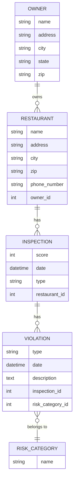

# README

Models Overview

### Assumptions

1. Each restaurant has one unique name.
2. Each owner has one unique name.
3. Inspection type, inspection date and inspection score are unique together - Could add a contraint later to the database to enforce this, if time.
4. Violation type, violation date, description and inspection are unique together for a violation. Assume that rows containing all of those fields with the same data are duplicates. Also, that the description is a description of the violation and belongs with violation. 

### With more time, here are some things I'd improve/add:

1. Inspection type seems to only have a few types, this could be its own table.
2. With more information on what data will be common in lookups, indexes could be added to the tables to make queries more performant.
